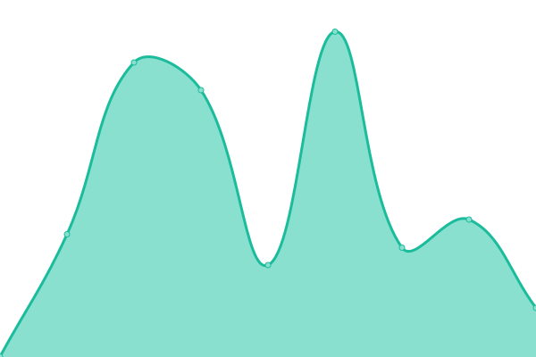
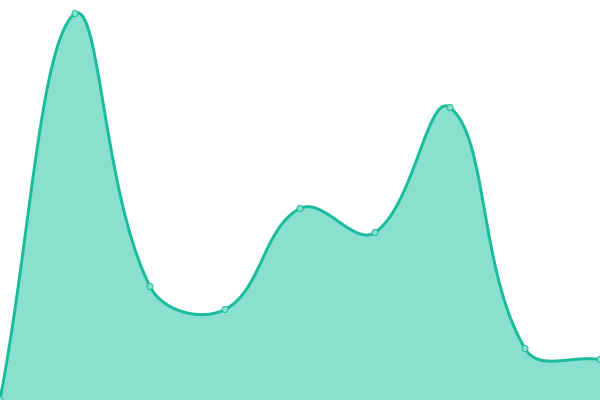
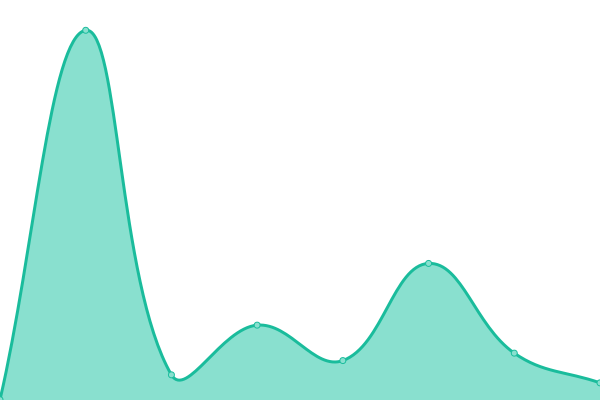

# [📈 Live Status](https://status.michaelis.net): <!--live status--> **🟩 All systems operational**

This repository contains the open-source uptime monitor and status page for [Benjamin Michaelis](benjamin.michaelis.net), powered by [Upptime](https://github.com/upptime/upptime).

With [Upptime](https://upptime.js.org), you can get your own unlimited and free uptime monitor and status page, powered entirely by a GitHub repository. We use [Issues](https://github.com/BenjaminMichaelis/SiteMonitor/issues) as incident reports, [Actions](https://github.com/BenjaminMichaelis/SiteMonitor/actions) as uptime monitors, and [Pages](https://status.michaelis.net) for the status page.

<!--start: status pages-->
<!-- This summary is generated by Upptime (https://github.com/upptime/upptime) -->
<!-- Do not edit this manually, your changes will be overwritten -->
<!-- prettier-ignore -->
| URL | Status | History | Response Time | Uptime |
| --- | ------ | ------- | ------------- | ------ |
|  [Landing Page](https://benjamin.michaelis.net/) | 🟩 Up | [landing-page.yml](https://github.com/BenjaminMichaelis/SiteMonitor/commits/HEAD/history/landing-page.yml) | 

 147ms
     
 | 

<a href="https://status.michaelis.net/history/landing-page">100.00%</a>
    

|  [Personal Site](https://dev.michaelis.net/) | 🟩 Up | [personal-site.yml](https://github.com/BenjaminMichaelis/SiteMonitor/commits/HEAD/history/personal-site.yml) | 

 219ms
     
 | 

<a href="https://status.michaelis.net/history/personal-site">100.00%</a>
    

|  [Photography Site](https://photography.michaelis.net/) | 🟩 Up | [photography-site.yml](https://github.com/BenjaminMichaelis/SiteMonitor/commits/HEAD/history/photography-site.yml) | 

 201ms
     
 | 

<a href="https://status.michaelis.net/history/photography-site">100.00%</a>
    

|  [Graph Sketchpad](https://graphsketchpad.michaelis.net/) | 🟩 Up | [graph-sketchpad.yml](https://github.com/BenjaminMichaelis/SiteMonitor/commits/HEAD/history/graph-sketchpad.yml) | 

 101ms
     
 | 

<a href="https://status.michaelis.net/history/graph-sketchpad">100.00%</a>
    

|  [Village Meal Generator](https://villagemealgenerator.michaelis.net/) | 🟩 Up | [village-meal-generator.yml](https://github.com/BenjaminMichaelis/SiteMonitor/commits/HEAD/history/village-meal-generator.yml) | 

 161ms
     
 | 

<a href="https://status.michaelis.net/history/village-meal-generator">100.00%</a>
    

<!--end: status pages-->

[**Visit our status website →**](https://status.michaelis.net)

## 📄 License

- Powered by: [Upptime](https://github.com/upptime/upptime)
- Code: [MIT](./LICENSE) © [Benjamin Michaelis](benjamin.michaelis.net)
- Data in the `./history` directory: [Open Database License](https://opendatacommons.org/licenses/odbl/1-0/)
